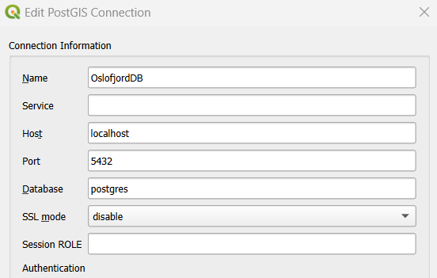

# OslofjordDB
OslofjordDB

Consists of six containers, one for the DB, one for Hasura, one for Apache Jena Fuseki, one for PGadmin, one running a script only at startup, and one serving as the web-api.

## Installation
Here i will explain step by step how to install the docker container with some data in the database.

1. Install docker desktop
2. Pull this repository
3. `cd` into `OslofjordDB`
4. Now you need to add the txt files containing the salinity and turbidity data to the txt_files folder. Currently it only support the salinity and turbidity data. The data files can be found on the google drive or in educloud. 
5. Now we can run the first python script to convert the txt files to csv files and generate the SQL file that inserts the data. Run the following code:  
` python3 db/scripts/dataToCsv_postgre.py `

6. Before we build the docker image it can be smart to change the password in the Docker compose-file. The password will later be used to connect to the database.
7. Create docker volumes using `docker create volume db_data`
8. Run `docker compose up -d` to start the containers in a detached state. 
To check that the containers are up and running, you can run `docker ps`.

After starting you can reach the following services:
- PGadmin can be reached at http://localhost:8888
- Hasura can be reached at http://localhost:8080 (for playing around with graphql on our data).

## API documentation
Since GraphQL is a self-documenting query language, it can be explored directly in the GraphiQL-playground available at http://localhost:8080. I would recommend exploring the data using the different types of queries. A tip is to use the "Docs"-page at the top right of GraphiQL, that includes comments and documentation about the different queries and mutations available. The GraphQL endpoint as well as the request headers needed to use the API are also available here.

For more information about how to explore the data using GraphQL, I would recommend checking out Hasura's own documentation:
- Queries: https://hasura.io/docs/latest/queries/overview/
- Mutations: https://hasura.io/docs/latest/mutations/overview/
- Subscriptions: https://hasura.io/docs/latest/subscriptions/overview/

There is also an example of how to connect to our Hasura GraphQL endpoint using Apollo Client running on a next.js-server.
- The example implementation can be found at: 'OslofjordDB/api/src/app/components/'
- There is also some example queries located in: 'OslofjordDB/api/src/app/queries/gqlQueries.jsx'

## DB manager

You can also connect to the database using another database manager. E.g. QGIS or DBeaver.

To connect you insert:
- host: "localhost"
- port: "5432"
- database: "postgres" 

You will also need to insert username and password when prompted. 
- Username: "postgres"
The password is stored in the compose-file. If you did not change it, just use the standard password that was already written in the file.  

